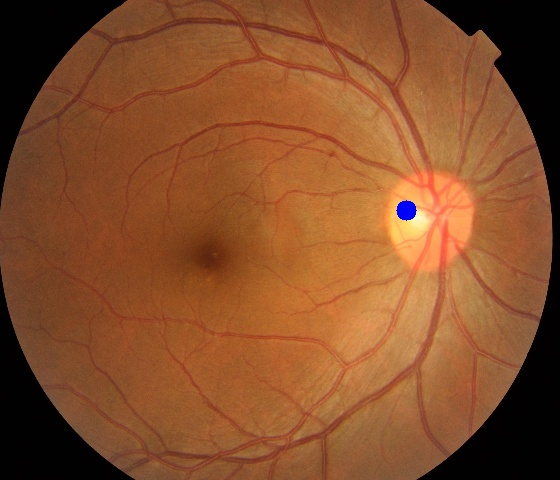
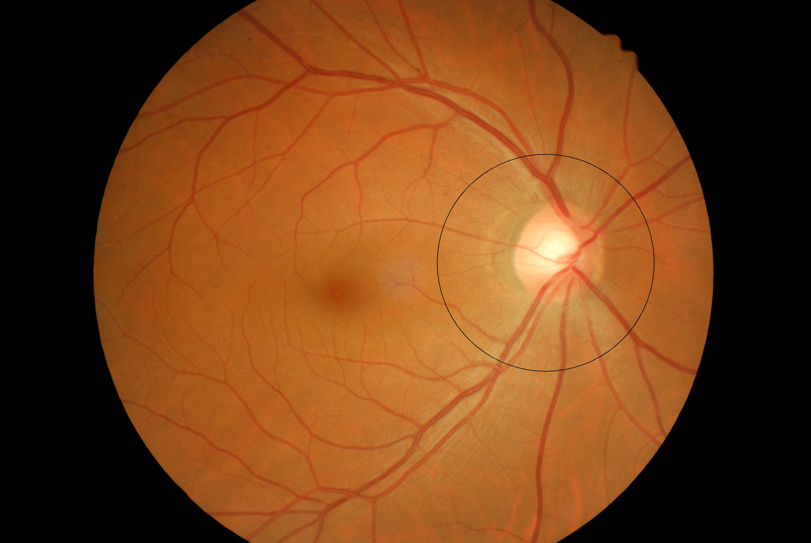
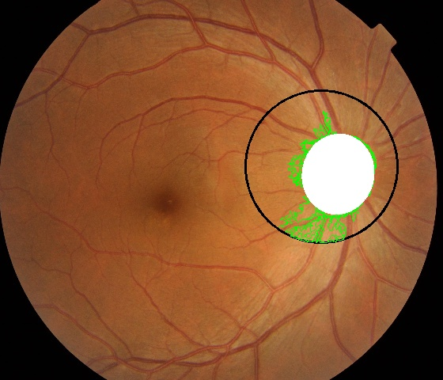
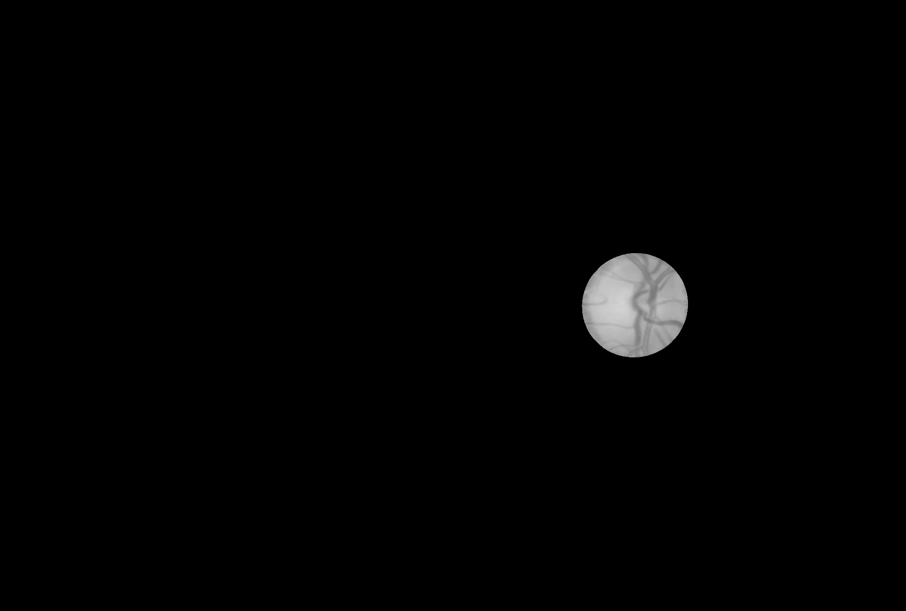

optic_extract.py
==============
참고 : <https://doi.org/10.1016/j.cmpb.2015.10.010>
***
  
  
##### 1.Original Image
##### 2.Find optic disk position 
##### 3.Crop circle including optic disk
##### 4.Draw contour
##### 5.Find fit-ellipse
##### 6.Optic disk result
