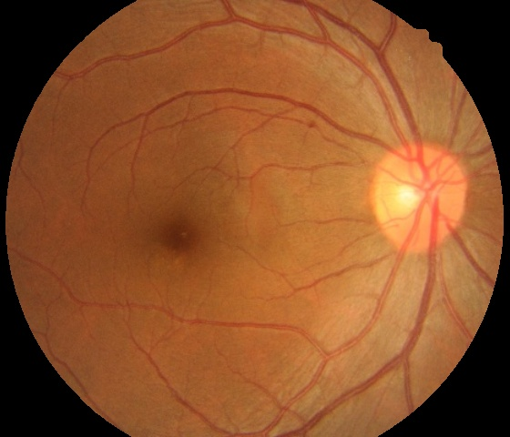

# optic_extract.py

참고 : <https://doi.org/10.1016/j.cmpb.2015.10.010>

- 오픈소스 이미지로 업데이트 필요
##### 1.Original Image
##### 2.Find optic disk position
Kaiser Window 적용시킨 후 사진 내에서 가장 밝은 지점
##### 3.Crop circle including optic disk
2에서 찾은 점을 중심으로 optic disk 포함하여 crop
##### 4.Draw contour
crop된 부분 binarization(특정 Threshold 지정가능) -> contour 
##### 5.Find fit-ellipse
contour의 fit-ellipse를 찾고 contour의 면적과 fit-ellipse의 면적비율(circularity)에 따라 optic disk로 채택
##### 6.Optic disk result

***
# edge_block.py

1. Read green image
2. Canny edge detect
3. Count edge block num

디렉토리의 이미지를 읽고 edge block기준 오름차순 정렬하여 sort_path에 저장

***
# makefilter.py

- 오픈소스 이미지로 업데이트 필요

filter_dir : 디렉토리 내 모든 이미지의 필터생성

filter_binary_average : 디렉토리 내 모든 이미지 binarization 후 평균한 필터생성

**filter_average_binary : 디렉토리 내 모든 이미지의 평균값을 binarization하여 필터생성 (threshold 40->100 반복)**

***
# zoomin.py

  

zoomin / zoomin_dir : 이미지 zoom-in

zoomin_cut / zoomin_cut_dir : 이미지 zoom-in 후 자신을 binarization한 filter 적용

**zoom_use_filter: 디렉토리 내 모든 이미지를 zoom-in 후 사전에 만들어진 filter를 이용하여 crop (makefilter.py에서 만들어진 filter)**
