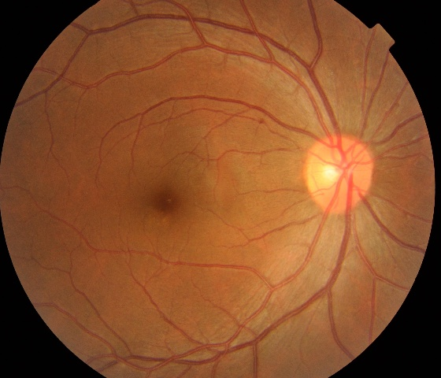
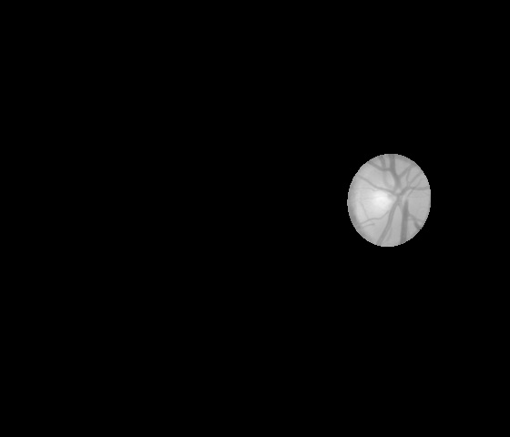

optic_extract.py
==============
참고 : <https://doi.org/10.1016/j.cmpb.2015.10.010>
***
 | 
Original Image | Find optic disk position

Crop circle including optic disk

Draw contour

Find fit-ellipse

Optic disk result
